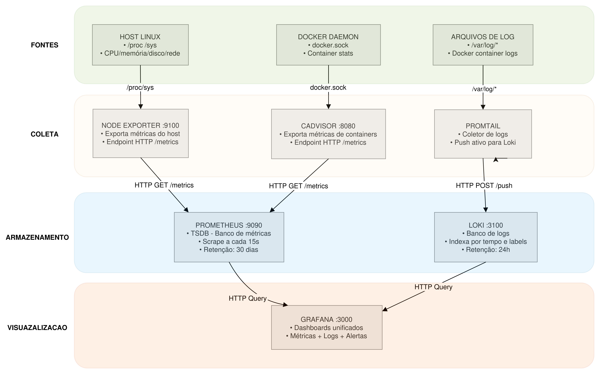

# Monitoring Stack (Docker & Cloudflare)

Observabilidade completa: métricas (Prometheus) + logs (Loki) via LGTM stack.

---

## 🏗️ Arquitetura



---

## 📋 Componentes

### Core (Armazenamento)

| Componente           | Stack   | Função                            | Porta |
| -------------------- | ------- | ----------------------------------- | ----- |
| **Grafana**    | LGTM ✅ | Visualização                      | 3000  |
| **Prometheus** | LGTM ❌ | Banco de métricas (CNCF)           | 9090  |
| **Loki**       | LGTM ✅ | Banco de logs                       | 3100  |
| **Tempo**      | LGTM ✅ | Traces*(futuro)*                  | -     |
| **Mimir**      | LGTM ✅ | Prometheus escalável*(opcional)* | -     |

### Coleta (Exporters & Agents)

| Componente              | Origem       | Função                | Porta | Destino    |
| ----------------------- | ------------ | ----------------------- | ----- | ---------- |
| **Node Exporter** | CNCF         | Métricas do host       | 9100  | Prometheus |
| **cAdvisor**      | Google       | Métricas de containers | 8080  | Prometheus |
| **Promtail**      | Grafana Labs | Coletor de logs         | -     | Loki       |

---

## ⚡ Início Rápido

```bash
docker-compose up -d
```

Acesse: http://localhost:3000
Login: `admin` / `admin`

---

## 🌐 Acesso Externo (Cloudflare)

```bash
# Instalar cloudflared
curl -L https://github.com/cloudflare/cloudflared/releases/latest/download/cloudflared-linux-amd64 \
  -o /usr/local/bin/cloudflared && chmod +x /usr/local/bin/cloudflared

# Autenticar (substitua pelo token do painel)
cloudflared service install <TOKEN>
```

Configure no painel Cloudflare:
**Zero Trust → Networks → Tunnels → Public Hostname**

| Campo     | Valor                   |
| --------- | ----------------------- |
| Subdomain | `grafana`             |
| Domain    | `seudominio.com`      |
| Service   | `HTTP localhost:3000` |

---

## 🔧 Comandos

```bash
# Logs
docker-compose logs -f [serviço]

# Restart
docker-compose restart [serviço]

# Parar
docker-compose down

# Limpar tudo (⚠️ perde dados)
docker-compose down -v
```

---

## 📊 Fluxo de Dados

| Origem        | → | Destino    | Protocolo | Método       | Frequência |
| ------------- | -- | ---------- | --------- | ------------- | ----------- |
| Node Exporter | → | Prometheus | HTTP      | Pull (scrape) | 15s         |
| cAdvisor      | → | Prometheus | HTTP      | Pull (scrape) | 15s         |
| Promtail      | → | Loki       | HTTP      | Push          | Real-time   |
| Prometheus    | → | Grafana    | HTTP      | Query         | On-demand   |
| Loki          | → | Grafana    | HTTP      | Query         | On-demand   |

---

## 🎯 Diferença: Node Exporter vs Promtail

| Aspecto             | Node Exporter        | Promtail              |
| ------------------- | -------------------- | --------------------- |
| **Coleta**    | Métricas (números) | Logs (texto)          |
| **Fonte**     | /proc, /sys          | /var/log, docker logs |
| **Direção** | Prometheus PUXA      | Promtail EMPURRA      |
| **Porta**     | 9100                 | Interno apenas        |
| **Destino**   | Prometheus           | Loki                  |

---

## 📝 Métricas Disponíveis

**Node Exporter**: CPU, memória, disco, rede, load
**cAdvisor**: CPU, memória, rede, disco **por container**
**Promtail**: /var/log/syslog, auth.log, nginx/, containers/*-json.log
