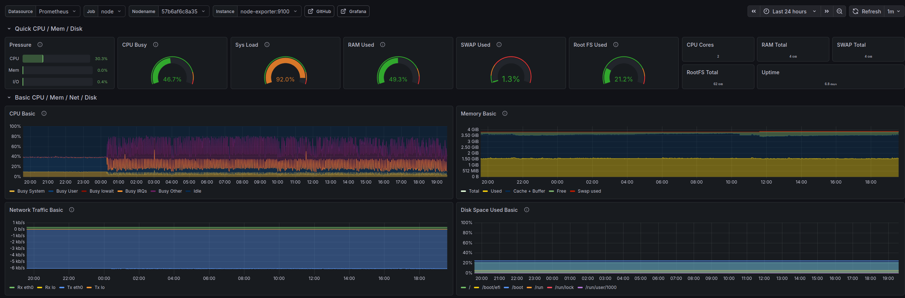

# Monitoring Stack (Docker & Cloudflare)

Infraestrutura de observabilidade para coleta de métricas e logs utilizando Docker Compose.
Esta stack automatiza o monitoramento de recursos do sistema e containers.

---

## Serviços

| Serviço | Descrição | Porta |
|---|---|---|
| **Grafana** | Visualização de dashboards | `3000` |
| **Prometheus** | Armazenamento de métricas temporais | — |
| **Loki & Promtail** | Agregação e processamento de logs | — |
| **Node Exporter** | Coleta de métricas do host (Hardware) | — |
| **cAdvisor** | Coleta de métricas específicas de containers | — |

---

## Início Rápido

Execute o comando abaixo no diretório raiz para subir os serviços:

```bash
docker-compose up -d
```

Acesso local: [http://localhost:3000](http://localhost:3000) — credenciais padrão: `admin` / `admin`


Exemplo de dashboard:


---

## Cloudflare Tunnel — Acesso Externo (Opcional)

> **Pré-requisito:** esta etapa exige um **domínio próprio registrado** e uma conta no
> [Cloudflare](https://dash.cloudflare.com). Sem essas condições, o Grafana permanece
> acessível apenas localmente via `localhost:3000`.

A exposição segura do Grafana para a internet é feita através do painel
**Cloudflare Zero Trust → Networks → Tunnels**.

### Passo a Passo no Painel

Acesse o painel em:

```
https://dash.cloudflare.com/<ACCOUNT_ID>/one/networks/connectors/cloudflare-tunnels
```

> Substitua `<ACCOUNT_ID>` pelo ID da sua conta Cloudflare, visível na URL após o login.

---

**1. Criar o Tunnel**
No painel, clique em **"Create a tunnel"** e dê um nome (ex: `monitoring`).

**2. Instalação do Conector**
Selecione a arquitetura do seu servidor (ex: `linux/amd64`) e instale o binário `cloudflared`:

```bash
# Exemplo para Debian/Ubuntu
curl -L https://github.com/cloudflare/cloudflared/releases/latest/download/cloudflared-linux-amd64 \
  -o /usr/local/bin/cloudflared
chmod +x /usr/local/bin/cloudflared
```

**3. Autenticação do Servidor**
Copie e execute o comando exibido em *"Install and run a connector"*. Ele contém o token
único do seu tunnel:

```bash
cloudflared service install <TOKEN_UNICO_GERADO_PELO_PAINEL>
```

**4. Configuração do Public Hostname**
Após o conector aparecer como **Connected**, acesse a aba **Public Hostname** e adicione:

| Campo | Valor |
|---|---|
| Subdomain | `grafana` |
| Domain | `seudominio.com` |
| Service Type | `HTTP` |
| URL | `localhost:3000` |

O Grafana ficará acessível publicamente em `https://grafana.seudominio.com`, com
TLS gerenciado automaticamente pelo Cloudflare.

---

## Métricas Disponíveis

Baseado no dashboard configurado, a stack monitora:

- **CPU** — Carga do sistema (Load), Busy User, System e I/O Wait
- **Memória** — Uso de RAM física, Cache/Buffer e utilização de SWAP
- **Rede** — Tráfego de entrada e saída (Rx/Tx) por interface (`eth0`, `lo`)
- **Disco** — Espaço ocupado em `/`, `/boot` e `/run`

---

## Manutenção

```bash
# Visualizar logs em tempo real
docker-compose logs -f

# Encerrar todos os serviços
docker-compose down
```